# SnapG

PySide6 application for partially automating myelinated axon segmentation in microscopy images.

---

## Installation

1. **Download** or clone this repository. To download this repository, scroll to the top of this GitHub page, click the green `<> Code` button, and then press `Download ZIP`. Then, extract the ZIP file.

2. **Install Python 3** if not already installed.

3. **Install dependencies**: Open a terminal in the `SnapG/` folder and run

    ```
    pip install -r requirements.txt
    ```

    If that doesn't work, try running

    ```
    py -m pip install -r requirements.txt
    ```

4. **Try opening the app**: For Mac users, open the `SnapG/` folder in Finder and double click the `SnapG.command` file. For Windows and Linux users, open a terminal in the `SnapG/` folder and run

    ```
    python src/main.py
    ```

    If that doesn't work, try either of the following commands

    ```
    python3 src/main.py
    py src/main.py
    ```

---

## How to Use SnapG

1. Open SnapG using one of the methods listed above. This window should appear:
  
  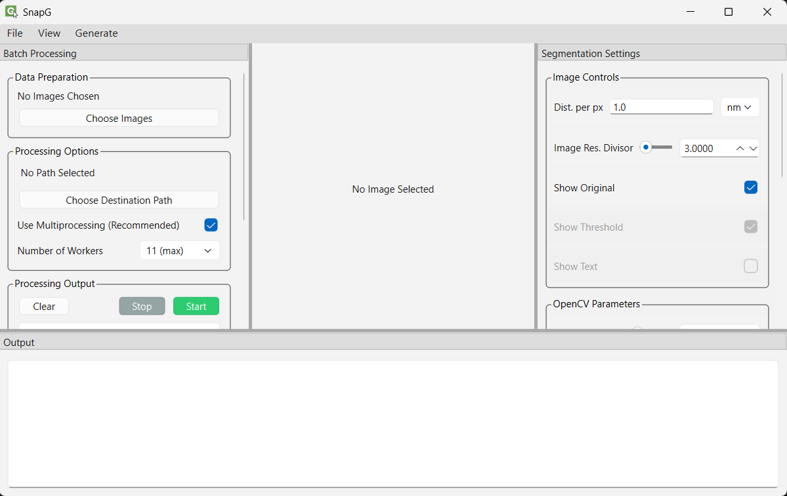

2. You're all set to start segmenting!


### Adjusting the View
Hover over the `View` menu in the top left. The following options should appear:
  
  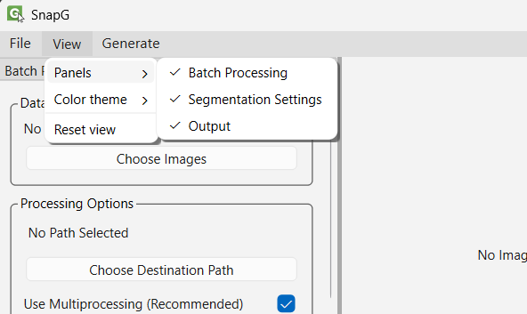

- **Panels**: You can show and hide the three panels using this menu.

- **Color Theme**: Only the "Light" color theme is currently available. More may be added!

- **Reset View**: Click this option at any time to reset the widths and heights of the panels.


### Opening Images

1. Hover over the `File` menu in the top left, and click on `Open… >` then `Image file(s)`.
  
  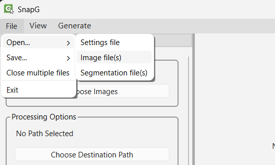

2. A file dialog will open. Select your images and confirm!
  
  

3. Your images should now be opened in the window.
  
  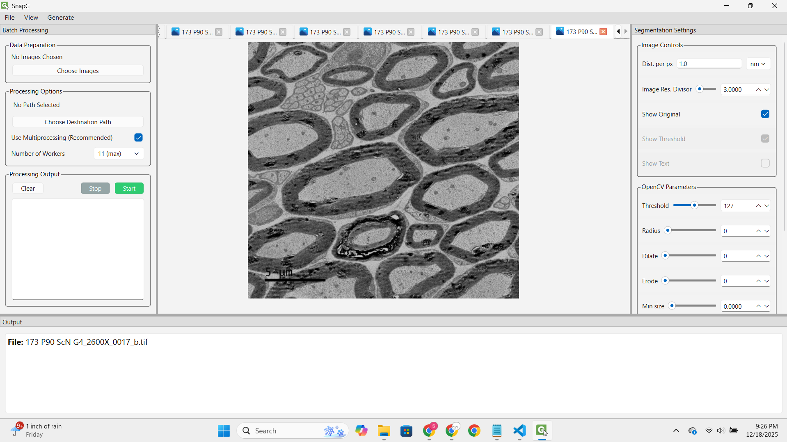


### Controlling the Image

1. To pan the image, press and drag right click in the image panel.
  
  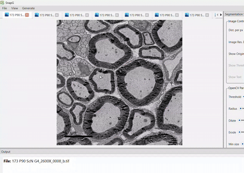

2. To zoom in and out, use the scroll wheel within the image panel.
  
  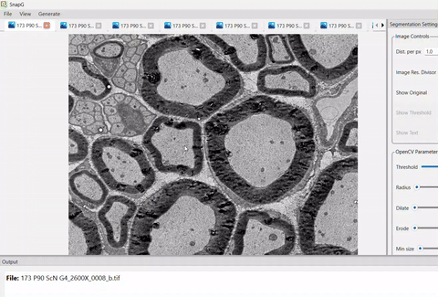


### Tuning the Segmentation Parameters

1. I suggest you close the `Batch Processing` panel for this part and widen the `Segmentation Settings` panel for enhanced visibility.

2. In the `Segmentation Settings` panel, there are adjustable *Image Control* parameters and *OpenCV Parameters*. To learn what each parameter controls, hover your mouse over each of them to show the tooltip.
  
  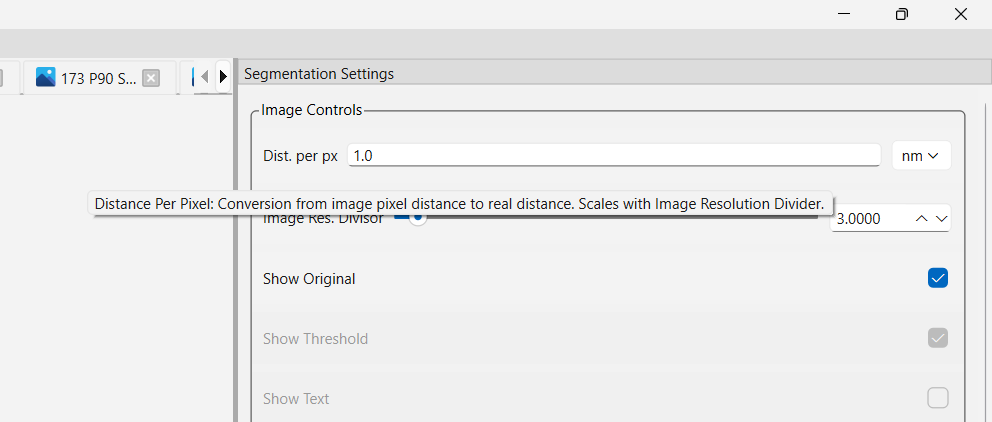

  In case the tooltip does not show up, you can find a list of each parameter's description [at the bottom of this README](#segmentation-parameter-descriptions).

3. Enter in your `Distance per pixel` value.
  
  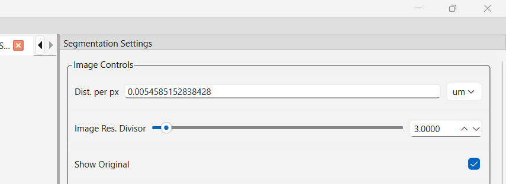

4. The only way to understand what each parameter does is to play around with them! First, *uncheck* the `Show Original` box and *check* the `Show Threshold` box.
  
  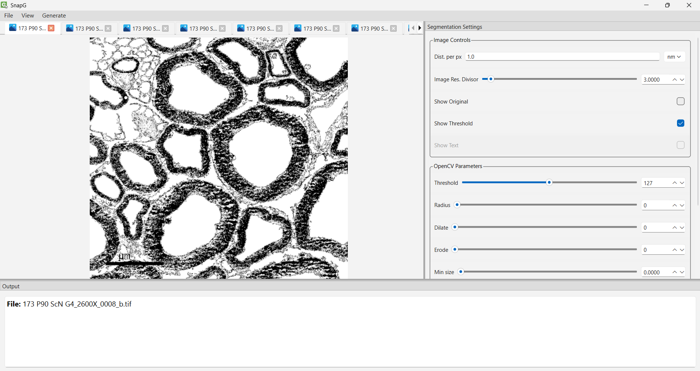

5. Adjust the `Image Resolution Divisor` slider and the `Threshold`, `Radius`, `Dilate`, and `Erode` sliders until the black-and-white image looks smooth and representative of the original image. I recommend setting `Image Resolution Divisor` as high as possible without losing too much detail, since it increases processing speed (especially because I am using a 4096x4096 image!).
  
  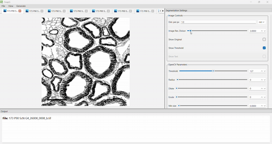

6. Next, *uncheck* the `Show Threshold` box and if you want, check the `Show Text` box (showing text may cause the image to process slower). Adjust the `Min size`, `Max size`, `Convexity`, `Circularity`, and `Thickness Percentile` sliders until axons and myelin are reliably detected in your images.
  
  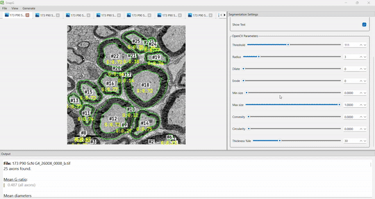

  In this gif, I set `Min size = 0.0010` and then repeatedly press `Ctrl+Tab` to look through each image and verify that there are minimal false negatives.

  *NOTE*: You may notice that the `Min size` parameter is very sensitive. This is expected behavior, which is why you may provide up to four decimal places of accuracy.

7. Verify that the distance measurements are roughly accurate by looking at the data in the `Output` panel. 
  
  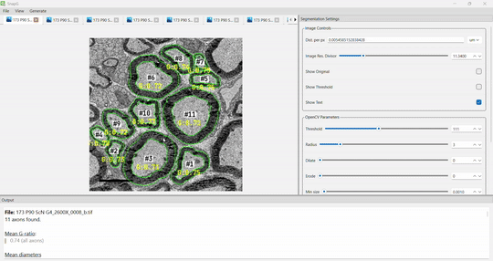

8. Don't overthink the parameters! Sometimes, only a little bit of adjustment is needed to get a decent segmentation result.


### Batch Processing

1. Show the `Batch Processing` panel by using the `View` menu in the top left. There should be a 


#### Save Your Settings

- Press **CTRL+S** to save current settings to a JSON file.
- Settings auto-save if the program is closed accidentally.

---

#### Buttons Instructions

Click these buttons in order:

- **Select Settings**: Choose the JSON settings file you saved.
- **Select Images**: Select the images you want to segment using these settings.
- **Process Images**: Choose an output folder. A "STOP" button will appear to the right if you need to cancel the operation.
  - This generates `.pkl` files containing contours and measurements for each image.
- **Review Output**: Select the `.pkl` files you want to review. Then, follow the instructions in the text box.
  - _Note: Disabling a contour in the reviewer doesn't delete it on exit; don't worry if you misclick._
- **Generate Data**: Select the `.pkl` files you want to generate a CSV file for. Then, choose an output folder to save your data to.

---

## Segmentation Parameter Descriptions

As mentioned in the [Tuning the Segmentation Parameters](#tuning-the-segmentation-parameters) section, here is a list of each parameter's description to give you a better idea of how the segmentation algorithm works.

### Image Controls

- **Distance Per Pixel**: Conversion from image pixel distance to real distance. Scales with Image Resolution Divider. This parameter is used when generating CSV data from segmented images.

- **Image Resolution Divisor**: How much to downscale the image by. For example, a value of 4 would shrink a 4096x4096 image to 1024x1024 before feeding it into the segmentation algorithm.

- **Show Original**: Whether to show the original image file. Useful for visually validating contours and thresholds.

- **Show Threshold**: Whether to show the thresholded binary (black and white) image. Useful for tuning OpenCV parameters.

- **Show Text**: Whether to show axon numbers and g-ratios on the image. Useful for checking data in the Output panel.


---

## Development

TODO

Building:
Delete `__pycache__` directories:
```
Get-ChildItem -Recurse -Directory -Filter "__pycache__" | Remove-Item -Recurse -Force
```

Rebuild command (Run from `SnapG/`):
```
pyinstaller main.spec
```

---
